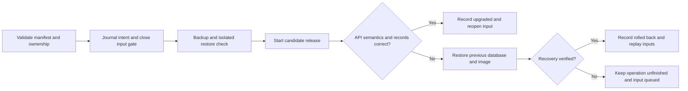

# Manufacturing application installation, upgrade and recovery

An executable Linux support tool for this repository's MES Spring API,
PostgreSQL 17 and Redis reference stack. It installs the application, verifies
backups by restoring them, upgrades a release, rolls back failed candidates,
recovers interrupted operations and produces sanitized diagnostic evidence.

**Reference-stack acceptance: 22/22 scenarios passed**, with 33 unit/export tests
and 7 abstract Lean theorems checked separately. See the
[exact-source acceptance result](acceptance-results.json),
[unit results](unit-results.json), [formal results](formal-results.json) and
[image scan results](security-results.json). Vendor and customer validation remain
outside the verified scope.

## Operator problem

A manufacturing application can return healthy HTTP while storing incorrect
results. A successful dump command can produce an unusable backup. A controller
can stop after changing containers but before recording the outcome. This tool
checks those boundaries before reopening input and preserves an unfinished
operation when it cannot establish recovery.

The KLA [Division MACH Software Applications Engineer posting](https://kla.wd1.myworkdayjobs.com/Search/job/Hwaseong-si-Korea/Division-MACH-Software-Applications-Engineer_2635584-1),
checked on 2026-09-30, motivated the installation, upgrades, Linux/database
troubleshooting and escalation workflows. This is independent reference software,
not a KLA product integration or evidence of prior customer/Klarity experience.

## Implemented workflows

| Workflow | Concrete behavior |
|---|---|
| Inspect and install | Validate explicit immutable local images, resources and ownership; create a bounded stack; verify API semantics and persisted records |
| Backup | Stop managed writes, dump PostgreSQL, verify checksum and restore into an isolated scratch database, compare records/schema/sequence state |
| Upgrade | Journal intent, drain, verify backup, launch release and migration, check real API and existing records before accepting it |
| Rollback | Restore verified database backup and prior application image; verify recovery; report `rolled_back`, not `upgraded` |
| Resume/recover | Require original operation identity, reconcile owned containers and evidence, keep ingress closed while the journal is unfinished |
| Input replay | Persist inputs before delivery; preserve event identity; distinguish queued, acknowledged, rejected and uncertain outcomes |
| Diagnose/escalate | Report readiness, versions, migration/lock/cache problems and network-namespace mismatch without exporting credentials or raw logs |



## Run

Follow the [operator runbook](RUNBOOK.md) for image builds, protected credentials,
a complete manifest, command order and recovery. Run from the repository root
with Python 3.10+, the pinned `operations/requirements.txt`, a local Linux Docker
engine, locally cached immutable images and a scoped MongoDB/GridFS account.

```sh
python3 -m operations.control inspect --manifest deployment.json
python3 -m operations.control install --manifest deployment.json
python3 -m operations.control evaluate --manifest deployment.json < event.json
python3 -m operations.control backup --manifest deployment.json
python3 -m operations.control upgrade --manifest deployment.json --candidate-image sha256:ACTUAL_IMAGE_ID
python3 -m operations.control replay --manifest deployment.json --limit 100
python3 -m operations.control diagnose --manifest deployment.json
python3 -m operations.control support-bundle --manifest deployment.json
```

The candidate placeholder must be replaced with an actual immutable image ID.
Supply `MESOPS_MONGO_URI`, `MESOPS_MONGO_DATABASE` and
`MESOPS_DATABASE_PASSWORD` through protected configuration, never command
arguments or committed files. The runbook includes exact interruption commands.

Application containers use no host ports, WAN access or host data mounts.
PostgreSQL owns a labeled persistent Docker volume. Private evidence, queue data
and backups use MongoDB/GridFS. All supported client writes use `evaluate` so
maintenance locking applies. Direct API writes bypass that contract.

`queued:true` means persisted for later processing, not completed evaluation.
`replay` is operator-driven; this CLI is not an always-running ingestion daemon.
A verified rollback returns a completed operation but does not promote the
candidate. Read the reported outcome rather than inferring promotion from exit 0.

## Verification

The [acceptance contract](ACCEPTANCE.md) defines the requirements and all scenarios.
The suite freezes implementation hashes and refuses success if they change during
execution. Every failed or interrupted attempt remains in private evidence.

```sh
python3 -m unittest discover -s operations/tests -v
python3 -m operations.formal_check --lean /path/to/lean
python3 -m operations.matrix --manifest deployment.json
```

The complete matrix runs sequentially: installation/restart, diagnostics, backup
integrity, ownership/concurrency/resource guards, existing application regression,
corrupt backup and failed restoration, queue recovery, schema upgrade, startup
failure, invalid SQL, semantic failure, lock timeout, six controller crash
boundaries and two 10,000-event workloads with different deterministic seeds.
Each workload contains 240,000 measurements. All 22 release scenarios passed; no unexecuted case was removed from the
denominator. Every disposable stack reported verified cleanup.

The [formal result](formal-results.json) records seven Lean theorems compiled
with Lean 4.33.1 and the specification hash. They establish abstract protocol
invariants, not correctness of Python, Docker, MongoDB or PostgreSQL. Read the
[protocol correspondence review](PROTOCOL_REVIEW.md) for runtime assumptions.

Measured on the exact images and source hashes in the acceptance result:

| Outcome | Events / measurements | Lost / duplicate / pending | Total seconds | Write gate seconds | Acknowledgement p95 seconds | Effective events/second |
|---|---:|---:|---:|---:|---:|---:|
| upgraded (seed 1) | 10,000 / 240,000 | 0 / 0 / 0 | 405.218 | 18.023 | 305.353 | 24.678 |
| rolled_back (seed 2) | 10,000 / 240,000 | 0 / 0 / 0 | 407.986 | 27.088 | 325.834 | 24.511 |

Acknowledgement latency includes queued waiting and operator-driven replay.
Effective rate includes validation work; neither metric is a customer SLA.
The workload uses four producer/replay workers, 32 equipment identities, four
sensors and six samples per event. The independent readback verifies identities,
values, response semantics and event/sample/verdict cardinality.

Pre-installation image admission, including a real non-PostgreSQL image refusal,
also passed before any deployment journal, volume or container was created.
Runtime readiness independently checks the actual PostgreSQL server version.

## Security evidence

The [image scan result](security-results.json) records the exact scan times and
package coverage. The final local images passed the current High/Critical gate:

| Image | Immutable image ID | Scan limitation |
|---|---|---|
| Application | `sha256:13f61cef0f9e26be5e6f5d22c7e40d1f4546d03106172173ab0c9204b48a2104` | 39 Medium and 4 Low findings remain |
| PostgreSQL | `sha256:433cd5ff23031f61c2dfc980a562df564d0fb2c730261526acc28fca5e201de9` | 45 OS packages scanned, 46 SBOM components |
| Redis | `sha256:b9826fd9cbcd1e629ed908b299204f5b73a7190711464020a3b0d0e44c0a1eba` | 16 OS packages scanned, 17 SBOM components |

The application build passed nine Java tests. The prior application image failed
with 4 Critical and 30 High findings and is not the final release artifact.
PostgreSQL runs directly as its unprivileged user; its unused vulnerable `gosu`
binary is removed. Redis preserves official 7.4.11 server/client hashes on the
patched Alpine 3.24 runtime. Source is in `images/`. A scan is time-specific and
does not establish vulnerability-free software or host/production approval.

## Limits that matter in use

- Supported target: this application's reference schema and API on one local
  Linux Docker engine. Klarity KD/ACE, Oracle/PL-SQL and customer rollout are
  **not implemented or validated**.
- Maintenance has downtime. It is not a rolling zero-downtime deployment system.
  Long queue latency is visible and must not be presented as low-latency service.
- Backup fingerprints cover public-table records, column metadata, constraints,
  indexes and sequence state. They do not prove arbitrary PostgreSQL catalog
  equivalence, grants, functions or extensions.
- Promotion requires unchanged complete row encodings in existing business
  tables. A data migration or column addition that changes those encodings is
  conservatively rejected, even if an operator considers it compatible. The
  verified schema upgrade adds an index and a release table; this is not a
  general data-transformation migration validator.
- Cross-host disaster recovery, loss of the MongoDB journal and external schema
  mutations are not validated recovery paths.
- Dependency namespace mismatch is diagnosed; automatic general repair is not
  implemented. The runbook describes the controlled reference-stack recovery.
- Completed journal history is capped at 100; new operations refuse rather than
  silently discarding history. An archival workflow is not implemented.
- The underlying API has no production authentication or equipment control.
  Do not expose this reference deployment as a customer production service.

## Failed development attempts and interpretation

These attempts are retained separately from the release matrix. They are not
counted as successful runs or used to estimate production failure probability.

| Attempt | Observed failure | Correction or disposition |
|---|---|---|
| First 10,000-event verification | Independent SQL readback exceeded its 120-second bound | Replace repeated per-event scans with grouped child-record reads; rerun the full workload |
| First seed-2 verification | Python 3.10 rejected PostgreSQL timestamps with trimmed fractional digits | Pad fractional digits without changing the instant; test 1 through 6 digits; rerun |
| Dependency restart diagnostics | App/cache retained the old database network namespace | Detect mismatch and verify controlled peer recreation while preserving the DB volume |
| Earlier application and database/cache images | High/Critical scanner findings | Reject those artifacts and build/scan replacement images before runtime revalidation |
| Older Alpine crypto-package patch | Requested fixed package was absent from that distribution's repositories | Use the supported patched runtime and retain upstream Redis binary hashes |
| Debian Redis alternative | Scanner gate still failed | Reject the alternative; do not treat a successful pull/build as approval |
| Initial default-network build | Builder could not reach the configured proxy | Use the reviewed build-only network path through the existing proxy |
| Interrupted intermediate suites | Runs stopped while replacing rejected images; one interruption reached cleanup | Reconcile exactly owned resources and defer interruption until bounded cleanup finishes |

## Original transaction component

`python3 -m operations.rehearse` retains the original two-row PostgreSQL experiment.
Its five scenarios compare autocommit with a transaction: historical scores were
2/5 and 5/5. That demonstrates basic transaction behavior, not practical deployment
coverage. Its `results.json` is separate from the 22-case controller acceptance.

Primary sources for the component are the PostgreSQL 17
[transaction tutorial](https://www.postgresql.org/docs/17/tutorial-transactions.html)
and [lock timeout documentation](https://www.postgresql.org/docs/17/runtime-config-client.html).
Synthetic workloads are not customer data or reproductions of KLA systems.
